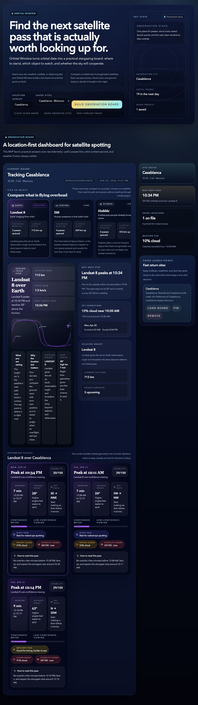

# Orbital Window

Orbital Window is a portfolio-ready aerospace MVP for people who want a practical answer to a simple question: _is there a satellite worth looking up for tonight?_

Live demo: [orbital-window.vercel.app](https://orbital-window.vercel.app)

It takes a real place on Earth, pulls live orbital and weather data, and turns that into a layman-friendly board with:

- a curated set of recognizable satellites
- upcoming pass windows
- a ground-track visualization
- weather-aware visibility scoring
- saved observing sites stored in SQLite/libsql

## Why This Project

This is intentionally not a tutorial clone. It combines:

- aerospace subject matter
- external APIs I did not build
- a real data layer
- a strong frontend presentation
- an interaction model that a non-technical person can understand immediately

## Stack

- SvelteKit
- TypeScript
- Tailwind CSS
- Drizzle ORM
- SQLite / libsql
- Playwright
- satellite.js

## External Data Sources

- [CelesTrak](https://celestrak.org/) for TLE orbital elements
- [Nominatim / OpenStreetMap](https://nominatim.org/) for place search
- [Open-Meteo](https://open-meteo.com/) for cloud cover and solar timing

## Local Development

```bash
npm install
npm run dev
```

Copy `.env.example` to `.env` if you want to override the default SQLite path. The app prefers `ORBITAL_WINDOW_DATABASE_URL` so it can coexist with other repos that already export a different `DATABASE_URL`.

## Scripts

```bash
npm run check
npm run build
npm run lint
npm run test:smoke
npm run capture:screens
```

## Screenshots

Playwright writes portfolio screenshots to `project-assets/screenshots/`.



## Sanity Prep

Sanity-ready project copy lives in `project-assets/sanity-project.json`.
